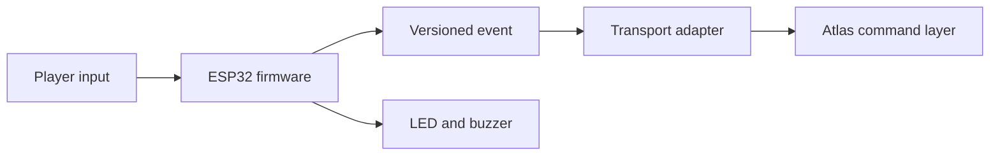

# Architecture

## Current vertical slice

The firmware owns input debouncing, cooldown protection, feedback, and event creation. The transport adapter owns serial, WiFi/WebSocket, or ESP-NOW delivery. Unity receives the same event shape regardless of transport.

## Event boundary

The prop never decides damage, healing, score, or win conditions. It sends player intent. Atlas remains authoritative for gameplay results.

## First hardware topology

Use one ESP32 controller connected by USB serial during the first real test. This removes radio variables while validating the input, feedback, and Unity integration. Add wireless transport only after this path is stable.

## Expansion path

| Stage | Hardware | Validation target |
| --- | --- | --- |
| A | One controller over USB | Inputs, cooldown, feedback, Unity mapping |
| B | One wireless controller and one hub | Packet envelope, reconnect, latency |
| C | Five simulated clients | Collision, ordering, load, operator visibility |
| D | Five real props | Range, power, interference, human use |
| E | Event kit | Recovery, spares, setup time, transport |

